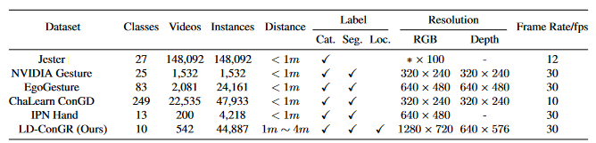

# LD-ConGR: A Large RGB-D Video Dataset for Long-Distance Continuous Gesture Recognition

## Introduction
<div align=center></div></div>
<center><font size=2>Fig. 1 Comparison of the LD-ConGR and popular gesture recognition datasets</font></center>

Gesture recognition plays an important role in natural human-computer interaction and sign language recognition. Existing research on gesture recognition is limited to close-range interaction such as vehicle gesture control and face-to-face communication. To apply gesture recognition to long-distance interactive scenes such as meetings and smart homes, we establish a large RGB-D video dataset LD-ConGR. LD-ConGR is distinguished from existing gesture datasets by its **long-distance gesture collection**, **fine-grained annotations**, and **high video quality**. Specifically, 1) the farthest gesture provided by the LD-ConGR is captured 4m away from the camera while existing gesture datasets collect gestures within 1m from the camera; 2) besides the gesture category, the temporal segmentation of gestures and hand location are also annotated in LD-ConGR; 3) videos are captured at high resolution (1280 x 720 for color streams and 640 x 576 for depth streams) and high frame rate (30 fps).

## The LD-ConGR Dataset
### Data Statistics
<div align=center></div>
<center><font size=2>Fig. 2 Ten gesture classes of LD-ConGR dataset</font></center>

LD-ConGR dataset contains 10 gesture classes, of which three are static gestures and seven are dynamic gestures (Fig. 1). A total of **542 videos** and **44,887 gesture instances** are collected in LD-ConGR. The videos are collected from 30 subjects in 5 different scenes and captured in a third perspective with Kinect V4. Each video contains a color stream and a depth stream. The two streams are recorded synchronously at 30 fps with resolutions of 1280 x 720 and 640 x 576, respectively. The dataset is randomly divided into training set and testing set by subjects (23 subjects for training and 7 subjects for testing). Number of gesture instances and statistics of gesture duration (measured in frames) are reported in Fig. 3. 
<!-- The 10 classes of gestures have high ease of use. We will continue to maintain the dataset and add new gesture classes. -->
<div align=center></div>
<center><font size=2>Fig. 3 Number of gesture instances and statistics of gesture duration</font></center>

### Data Download
The data is only allowed for academic research. You can access LD-ConGR dataset only after signing the [Agreement](Agreement.pdf) and sending it to diananiniliu@gmail.com. We will email you the dataset download link. The total download size is about 42 GB.

### Evaluation Metric
According to whether the temporal boundary of the gesture is pointed out, gesture recognition can be divided into isolated gesture recognition (IsoGR) and continuous gesture recognition (ConGR). IsoGR refers to the classification of a given sequence that contains a single gesture. ConGR refers to detecting the beginning and end of each gesture instance and identifying its category for a given video sequence, which may contain more than one gesture.

The accuracy is adopted to evaluate the model for IsoGR task. For ConGR, the mean Jaccard Index is used as in [1]. The ConGR evaluation tool can be found in the `eval_jaccard` directory. Compute the mean Jaccard Index:
```
python eval_jaccard/con_score.py test_labels.txt results.txt
```
`test_labels.txt` and `results.txt` store the ground truths and prediction results, one video each line: `<videoName>,<gesture1>,<gesture2>,...`. Each gesture is represented by `<startFrame> <endFrame> <label>`.


### Baseline
<div align=center></div>
<center><font size=2>Fig. 4 Experimental results</font></center>
Based on the proposed LD-ConGR dataset, we conducted a series of experimental explorations. A baseline model based on 3D ResNeXt is implemented and achieves 85.33% accuracy on RGB data. To make good use of the depth information, we learn from the ideas of [2] and build a multimodal gesture recognition model ResNeXt-MMTM. It achieves an accuracy of 89.66% on LD-ConGR. Moreover, we propose two strategies, gesture region estimation and key frame sampling, to deal with long-distance gesture recognition and the uncertainty of gesture duration. Refer to [our paper](LD-ConGR-CVPR2022.pdf) for more details. The code is in [resnext-mmtm](resnext-mmtm).

### Citation
If you find useful the LD-Con dataset for your research, please cite the paper:
```
@inproceedings{ld-congr-cvpr2022,
    title={LD-ConGR: A Large RGB-D Video Dataset for Long-Distance Continuous Gesture Recognition},
    author={Dan Liu and Libo Zhang and Yanjun Wu},
    booktitle={CVPR},
    year={2022}
}
```

### Ref
<font size=2.5>
[1] Jun Wan, Yibing Zhao, Shuai Zhou, Isabelle Guyon, Sergio Escalera, and Stan Z Li. Chalearn looking at people rgb-d isolated and continuous datasets for gesture recognition. In CVPRW, pages 56–64, 2016.  
[2] Hamid Reza Vaezi Joze, Amirreza Shaban, Michael L Iuz-zolino, and Kazuhito Koishida. Mmtm: Multimodal transfer module for cnn fusion. In CVPR, pages 13289–13299, 2020.
</font>